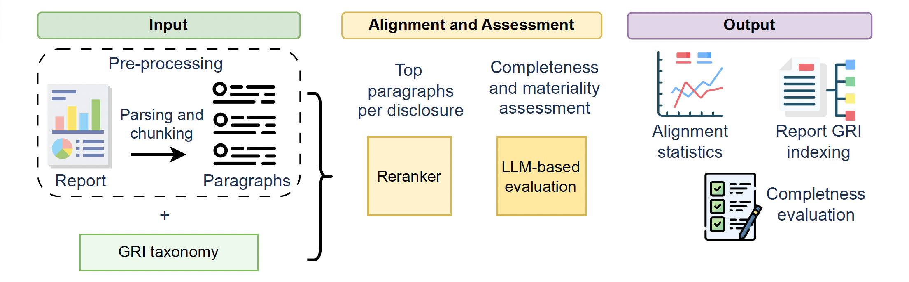

# ReportGRI: Automating GRI Alignment and Report Assessment
---


Welcome to the ReportGRI project repository. This tool provides easy visual analytics for corporate sustainability reports (CSRs) based on Global Reporting Initiative (GRI) disclsoure requirements. The reports are checked for GRI disclosure completeness and materiality and receive GRI indexing suggestions. As part of this project we are primarily focusing on: **Standardising unstructured data from CSRs, Creating environemntal, social, governance (ESG) benchamrking and Generating LLM-based assessment of report coverage**.

Main features of ReportGRI include:
- **GRI disclosure-paragrph distribution** of reports
- **Report topical focus** with respect to GRI standard topics
- **Disclosure assessment** for completeness and materiality
- **Upload your report** to view the GRI distribution and do comparative analysis with industry peers, and receive LLM-based indexing suggestions

The deployed version could be tested on https://reportgri.nliwod.org/

---
## Installation and Setup

### Prerequisites

- Node.js (>=18) and npm
- Python 3.10+ with pip
- Docker + Docker Compose (optional for Docker setup)

Clone the repository
```bash
git clone https://github.com/aidausmanova/reportGRI.git
cd reportGRI
```

Environment setup
```bash
cd backend
conda create --name reportgri python=3.10
conda activate reportgri 
pip install -r requirements.txt
```

To test pipeline only, add your report in PDF format to `data/original/` and run the script with your report name specified in `run_test_pipeline.sh`.
```bash
bash scirpts/run_test_pipeline.sh
```
---
### Backend Setup (FastAPI)
Run FastAPI
```bash
uvicorn main:app --reload
```

> Server will start at: http://localhost:8000
---

### Frontend Setup (React 19 + TailwindCSS)
Install Frontend Packages
```bash
cd frontend
npm install
```

Run Vite Dev Server
```bash
npm run dev
```

> Frontend will start at: http://localhost:5173

---

### Optional: Docker Setup (Combined)

Build and Start All Containers
```bash
docker-compose up --build
```

> Backend on http://localhost:8000  
> Frontend on http://localhost:5173

---

## Note
To use gpt-3.5-turbo-1106, create .env file and add your api key as in the example below:
```bash
OPENAI_API_KEY=<Your OpenAI key>
BASE_URL='https://api.openai.com/v1'
```

Thank you for your interest in our project! We hope you find this repository useful and informative.
